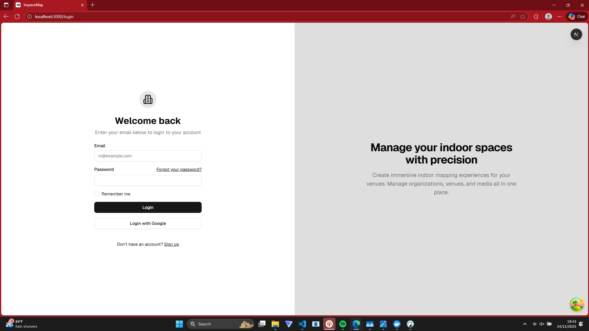
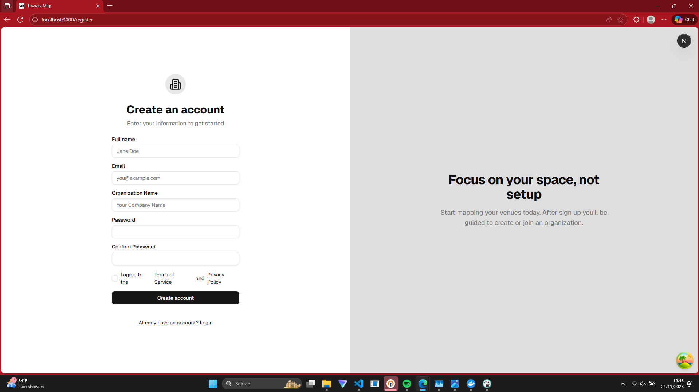
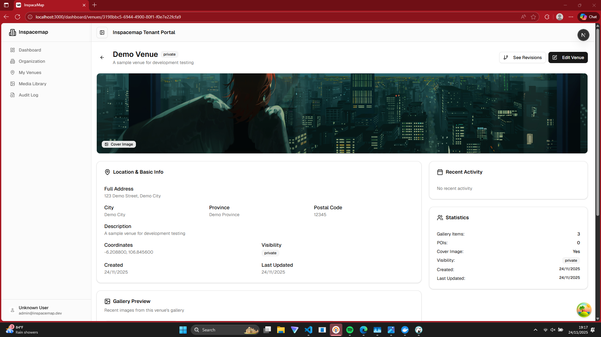
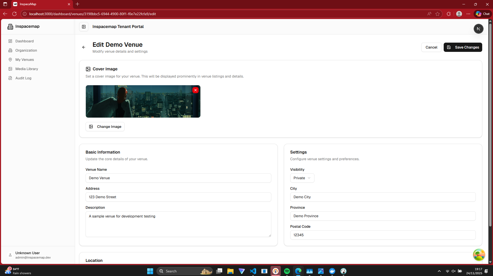
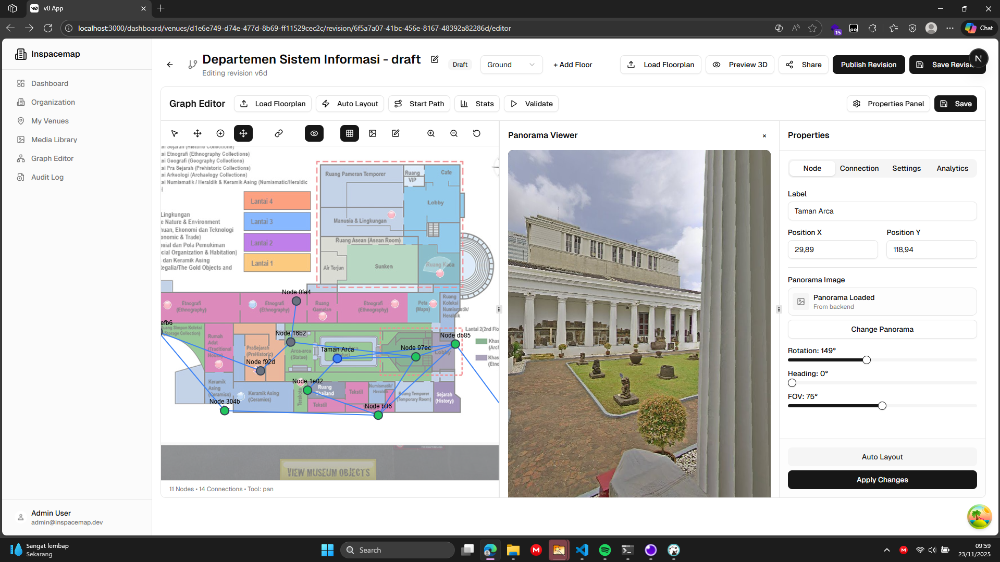
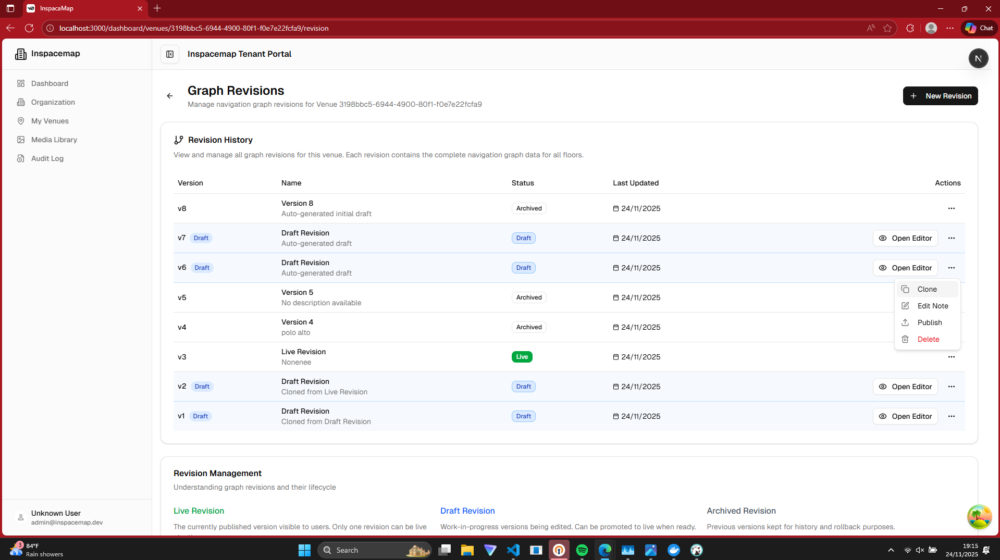
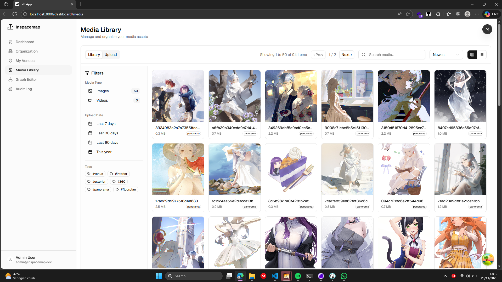

# InSpaceMap Tenant Portal

A modern web application for managing venue navigation graphs and indoor mapping systems. Built with Next.js 16, TypeScript, and cutting-edge web technologies.

## 🌟 Features

### 🏢 Venue Management

- **Multi-venue Support**: Manage multiple venues within a single tenant
- **Venue Details**: Comprehensive venue information including location, contact details, and media galleries
- **Organization Structure**: Hierarchical organization management with role-based access

### 🗺️ Graph Editor

- **Interactive Canvas**: Drag-and-drop interface for creating navigation graphs
- **Floor Management**: Multi-floor support with individual floor plans
- **Node & Connection System**: Create waypoints and define navigation paths
- **360° Panorama Integration**: Embed panoramic images for immersive navigation
- **Real-time Collaboration**: Multi-user editing capabilities

### 📊 Revision Control

- **Version Management**: Track changes with comprehensive revision history
- **Draft/Publish Workflow**: Create drafts and publish changes when ready
- **Clone Revisions**: Duplicate existing revisions for experimentation
- **Audit Trail**: Complete history of all changes and modifications

### 🖼️ Media Management

- **Media Library**: Centralized storage for images, floor plans, and panoramas
- **Drag & Drop Upload**: Intuitive file upload with progress tracking
- **Media Picker**: Easy selection and integration with venue content
- **Format Support**: Support for various image formats and file types

### 🔐 Authentication & Security

- **Role-Based Access Control**: Granular permissions for different user types
- **Secure Authentication**: JWT-based authentication with refresh tokens
- **Permission Guards**: Component-level access control

## 🚀 Tech Stack

### Frontend Framework

- **Next.js 16** - React framework with App Router
- **React 19** - Latest React with concurrent features
- **TypeScript** - Type-safe JavaScript

### UI & Styling

- **Tailwind CSS 4** - Utility-first CSS framework
- **shadcn/ui** - Modern component library built on Radix UI
- **Lucide React** - Beautiful icon library
- **next-themes** - Dark/light theme support

### 3D & Graphics

- **Three.js** - 3D graphics library
- **@react-three/fiber** - React renderer for Three.js
- **@react-three/drei** - Useful helpers for React Three Fiber
- **@egjs/view360** - 360° panorama viewer

### State Management

- **Zustand** - Lightweight state management
- **@tanstack/react-query** - Server state management
- **React Hook Form** - Form state management

### Development Tools

- **ESLint** - Code linting
- **PostCSS** - CSS processing
- **Autoprefixer** - CSS vendor prefixing

## 📁 Project Structure

```
inspacemap-tenant-portal/
├── app/                          # Next.js App Router
│   ├── (auth)/                   # Authentication pages
│   ├── dashboard/                # Dashboard pages
│   │   ├── venues/               # Venue management
│   │   └── organizations/        # Organization management
│   ├── globals.css               # Global styles
│   └── layout.tsx                # Root layout
├── components/                   # Reusable components
│   ├── ui/                       # shadcn/ui components
│   ├── editor/                   # Graph editor components
│   ├── auth/                     # Authentication components
│   ├── media/                    # Media management components
│   └── organizations/            # Organization components
├── lib/                          # Utility libraries
│   ├── api.ts                    # API client
│   ├── services/                 # Business logic services
│   └── utils.ts                  # Utility functions
├── stores/                       # Zustand stores
├── types/                        # TypeScript type definitions
├── hooks/                        # Custom React hooks
├── providers/                    # React context providers
└── public/                       # Static assets
```

## 🛠️ Installation & Setup

### Prerequisites

- **Node.js** 18+ (LTS recommended)
- **pnpm** 9.6+ (or npm/yarn)
- **Git** for version control

### Quick Start

1. **Clone the repository**

   ```bash
   git clone https://github.com/ascndia/inspacemap-tenant-fe.git
   cd inspacemap-tenant-fe
   ```

2. **Install dependencies**

   ```bash
   pnpm install
   ```

3. **Environment setup**

   ```bash
   cp .env.example .env
   ```

   Edit `.env` with your configuration (see [ENV_SETUP.md](ENV_SETUP.md))

4. **Start development server**

   ```bash
   pnpm dev
   ```

5. **Open your browser**
   Navigate to [http://localhost:3000](http://localhost:3000)

### Build for Production

```bash
# Build the application
pnpm build

# Start production server
pnpm start
```

## 🔧 Configuration

### Environment Variables

See [ENV_SETUP.md](ENV_SETUP.md) for detailed environment configuration.

### Key Configuration Files

- `next.config.mjs` - Next.js configuration
- `tailwind.config.js` - Tailwind CSS configuration
- `tsconfig.json` - TypeScript configuration
- `components.json` - shadcn/ui configuration

## 📱 Screenshots

### Authentication


_Secure login interface with form validation_


_User registration with organization setup_

### Venue Management


_Comprehensive venue information dashboard_


_Venue editing interface with media management_

### Graph Editor


_Interactive canvas for navigation graph creation_

### Revision Control


_Revision management with draft/publish workflow_

### Media Management


_Centralized media storage and organization_


_Intuitive media selection interface_

## 🎯 Key Features Deep Dive

### Graph Editor System

The heart of InSpaceMap is its sophisticated graph editor that allows users to create detailed indoor navigation maps:

- **Canvas-based Interface**: Intuitive drag-and-drop editing
- **Multi-floor Support**: Handle complex multi-level venues
- **Node Types**: Waypoints, entrances, POIs, and custom nodes
- **Connection Management**: Define navigation paths and relationships
- **Panorama Integration**: Embed 360° images for immersive previews
- **Real-time Validation**: Ensure graph integrity and connectivity

### Revision Management

Professional-grade version control for navigation data:

- **Draft State**: Work on changes without affecting live navigation
- **Publish Workflow**: Controlled deployment of navigation updates
- **Clone Functionality**: Duplicate revisions for testing or branching
- **Audit History**: Complete change tracking and rollback capabilities

### Media Integration

Comprehensive media management system:

- **File Upload**: Drag-and-drop with progress indicators
- **Format Support**: Images, floor plans, panoramas
- **Organization**: Tagging, categorization, and search
- **Integration**: Seamless embedding in venues and graphs

## 🤝 Contributing

1. Fork the repository
2. Create a feature branch (`git checkout -b feature/amazing-feature`)
3. Commit your changes (`git commit -m 'Add amazing feature'`)
4. Push to the branch (`git push origin feature/amazing-feature`)
5. Open a Pull Request

### Development Guidelines

- Follow TypeScript strict mode
- Use ESLint configuration
- Write meaningful commit messages
- Test your changes thoroughly
- Update documentation as needed

## 📝 License

This project is proprietary software owned by InSpaceMap. All rights reserved.

## 🆘 Support

For support and questions:

- Create an issue in this repository
- Contact the development team
- Check the documentation

## 🔄 Recent Updates

- ✅ **Clone Revision Feature**: Added ability to duplicate existing revisions
- ✅ **Enhanced UI Components**: Improved dropdown menus and modal dialogs
- ✅ **Type Safety**: Comprehensive TypeScript coverage
- ✅ **Performance Optimizations**: Improved build times and runtime performance

---

**Built with ❤️ by the InSpaceMap Team**

_Transforming indoor navigation with cutting-edge web technology_
